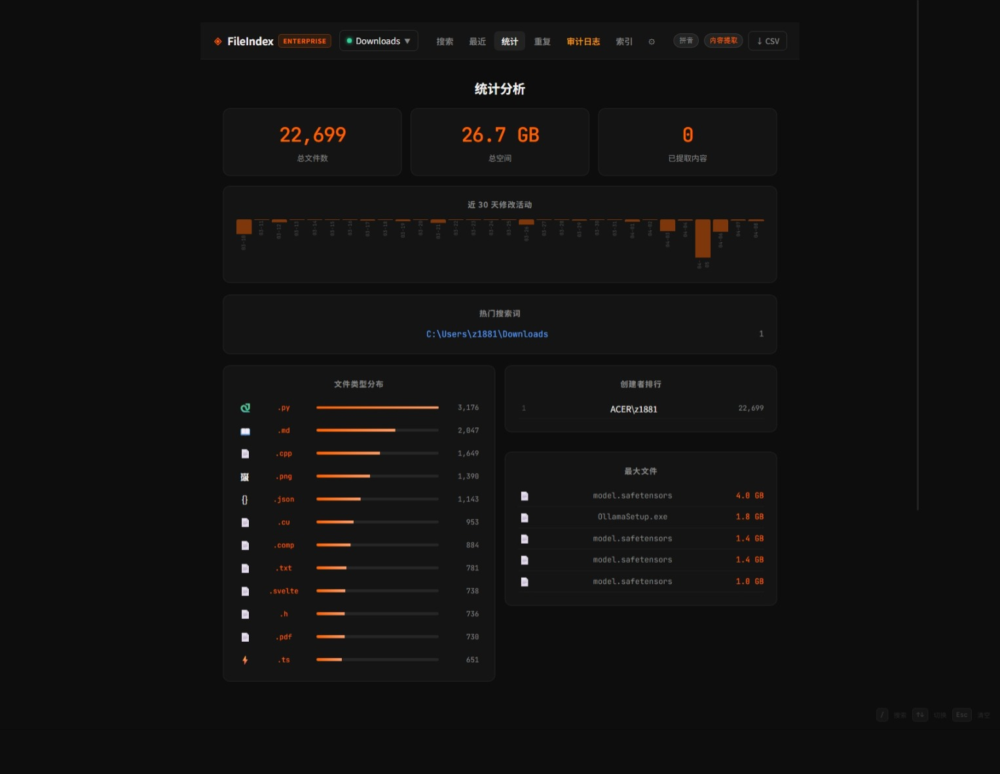
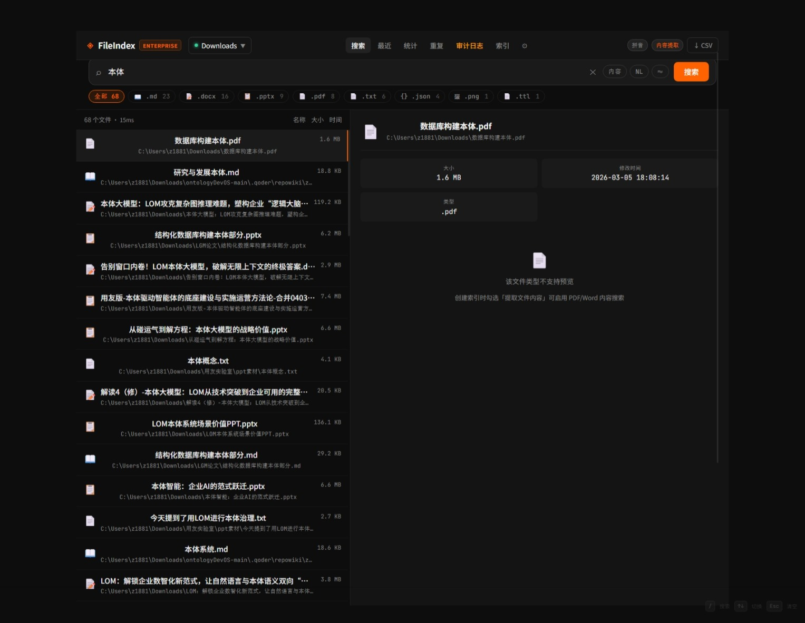

# FileIndex — 让你的硬盘文件触手可及

> 再也不用翻文件夹找文件。  
> FileIndex 为你的本地硬盘建立闪电级索引，支持模糊搜索、拼音搜索，全程离线，数据 100% 留在你自己的电脑上。

支持 **Windows / Linux / macOS**

---

## 你是否有过这些烦恼？

- 🗃️ 硬盘上有几十万个文件，找一个靠记忆和运气
- 🔤 记不清文件名全拼，只知道大概叫什么
- 📂 文件散落在多个目录，不知道从哪开始翻
- 🔁 每次重启电脑都要重新等待扫描
- 🔒 担心文件信息被上传到云端

**FileIndex 就是为解决这些问题而生的。**

---

## 核心功能一览

### 🔍 强大的文件搜索
- **精确搜索**：按文件名、路径、创建者快速定位
- **模糊搜索**：打错字也没关系，`报告` 打成 `报告` 也能找到
- **拼音搜索**：输入 `baogao` 即可匹配「报告.docx」，特别适合中文文件名
- **按类型筛选**：点击扩展名标签，只看 PDF / Excel / 图片……
- **排序 & 分页**：按大小、时间灵活排序，百万文件也不卡

### 📊 统计分析，一眼掌握磁盘全貌
- 文件类型分布图，点击即可跳转搜索
- 最大文件排行、创建者排行，快速发现空间黑洞

### 💾 索引持久化，无需反复等待
- 扫描结果保存在本地数据库，重启后立即可用
- 支持对多个目录分别建立索引，侧边栏一键切换

### 🛡️ 完全本地，隐私有保障
- 所有数据均存储在你自己的电脑上
- 不联网、不上传、不注册账号




---

## 快速上手（5 分钟跑起来）

### 环境要求

- Python 3.8 或以上
- Node.js 16 或以上

### 第一步：启动后端服务

```bash
cd backend
pip install -r requirements.txt
python app.py
```

启动成功后，你会看到：

```
✦ FileIndex backend  →  http://localhost:3000
  fuzzy engine  : rapidfuzz        ← 模糊搜索已就绪
  pinyin support: True             ← 拼音搜索已就绪
  database      : /path/to/fileindex.db
```

### 第二步：启动前端界面

```bash
cd frontend
npm install
npm run dev
```

打开浏览器访问 **http://localhost:5173**，即可使用。

### 第三步（可选）：构建生产版本

```bash
cd frontend
npm run build
```

---

## 使用流程

### 1. 建立索引
进入「索引目录」页 → 输入你要扫描的文件夹路径 → 点击「开始索引」。  
扫描进度实时显示，完成后自动进入统计页。你可以为每个索引起一个好记的名字，方便以后切换。

### 2. 搜索文件
进入「文件搜索」页，直接在搜索框输入关键词，支持：
- 汉字 / 英文 / 拼音混合输入
- 开启「模糊」开关，容忍拼写错误
- 点击扩展名标签按类型筛选
- 点击列头按大小 / 时间排序

### 3. 查看统计
进入「统计分析」页，查看磁盘使用全貌，快速找出最占空间的文件类型或文件。

### 4. 个性化设置
进入「设置」页，你可以：
- 设置**忽略规则**（如跳过 `node_modules`、`.git` 等无用目录）
- 调整**模糊匹配灵敏度**（推荐值 55%，越高越严格）
- 开启 **API Key 保护**，防止他人访问你的索引服务

---

## 后续计划

我们正在开发以下功能，敬请期待：

- [ ] 文件内容全文检索（不只搜文件名）
- [ ] 增量扫描，只处理新增 / 变更的文件
- [ ] 多目录同时并发索引
- [ ] 接入本地 AI（Ollama）进行语义搜索
- [ ] 定时自动重建索引
- [ ] 多台机器之间的索引同步

---

## 常见问题

**Q：扫描很慢怎么办？**  
A：可以在设置中添加忽略规则，跳过 `node_modules`、系统目录等无意义的路径，可大幅缩短扫描时间。

**Q：重启电脑后还需要重新扫描吗？**  
A：不需要。索引已持久化保存在本地数据库，重启后直接可用。

**Q：支持搜索文件内容吗？**  
A：当前版本仅支持搜索文件名和路径，文件内容全文检索在开发计划中。

**Q：我的文件信息会上传到网络吗？**  
A：绝对不会。FileIndex 完全离线运行，所有数据只存在你的本地电脑上。

---

## 开源协议

ISC License — 自由使用，欢迎贡献。

---

> 💡 **隐私承诺**：FileIndex 不联网、不收集任何数据，你的文件信息始终只属于你。
