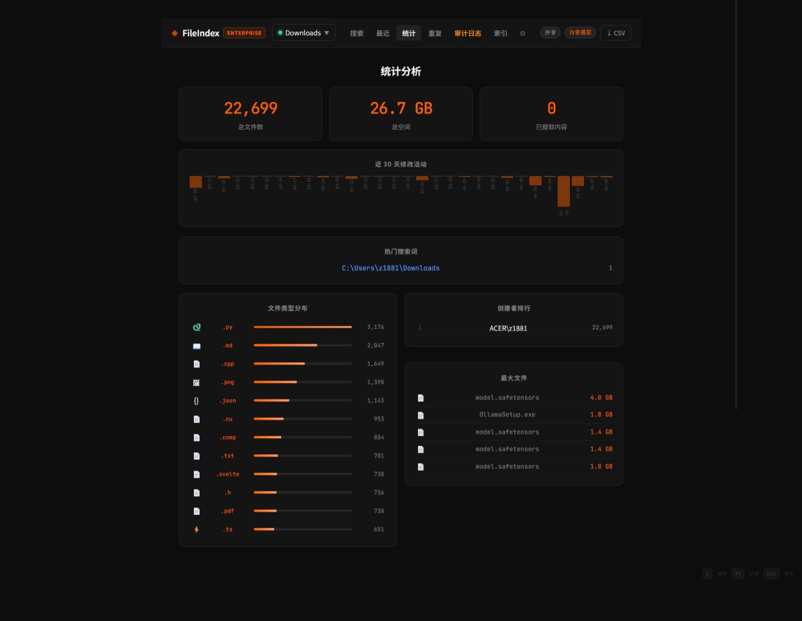
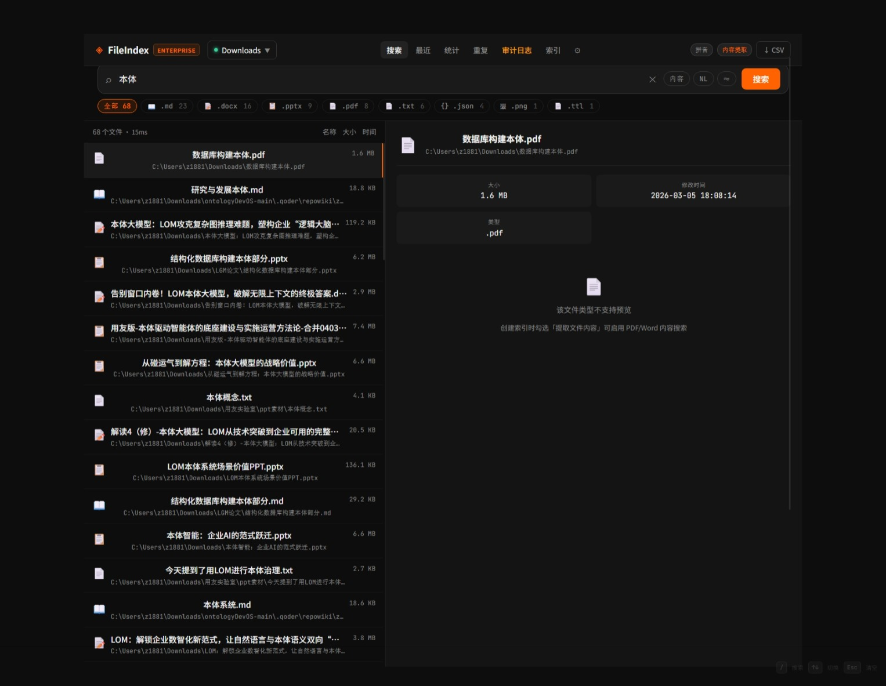

# FileIndex — Your Disk Files at Your Fingertips

**English** | [简体中文](./README.zh-CN.md)

> Stop digging through folders to find files.
> FileIndex builds a lightning-fast index of your local disks, with fuzzy search and pinyin search — fully offline, 100% of your data stays on your own computer.

Works on **Windows / Linux / macOS**

---

## Sound familiar?

- 🗃️ Hundreds of thousands of files on your disk; finding one comes down to memory and luck
- 🔤 You can't recall the exact filename, only roughly what it was called
- 📂 Files are scattered across many directories and you don't know where to start
- 🔁 Every reboot means waiting for a full rescan
- 🔒 You worry about your file information being uploaded to the cloud

**FileIndex was built to solve exactly these problems.**

---

## Feature Highlights

### 🔍 Powerful file search
- **Exact search**: locate files quickly by name, path, or creator
- **Fuzzy search**: typos are OK — a slightly wrong query still finds the file
- **Pinyin search**: type `baogao` to match 「报告.docx」 — especially handy for Chinese filenames
- **Filter by type**: click an extension tag to see only PDF / Excel / images…
- **Sort & paginate**: flexible sorting by size and time, smooth even with millions of files

### 📊 Statistics: the whole disk at a glance
- File-type distribution chart; click it to jump straight into search
- Largest-file and top-creator rankings to spot space hogs fast

### 💾 Persistent index, no repeated waiting
- Scan results are saved in a local database, ready to use right after a restart
- Build separate indexes for multiple directories; switch between them from the sidebar in one click

### 🛡️ Fully local, privacy guaranteed
- All data is stored on your own computer
- No internet access, no uploads, no account required




---

## Quick Start (Up and Running in 5 Minutes)

### Requirements

- Python 3.8 or above
- Node.js 16 or above

### Step 1: Start the backend

```bash
cd backend
pip install -r requirements.txt
python app.py
```

When it starts successfully, you will see:

```
✦ FileIndex backend  →  http://localhost:3000
  fuzzy engine  : rapidfuzz        ← fuzzy search ready
  pinyin support: True             ← pinyin search ready
  database      : /path/to/fileindex.db
```

### Step 2: Start the frontend

```bash
cd frontend
npm install
npm run dev
```

Open **http://localhost:5173** in your browser and start using it.

### Step 3 (optional): build a production bundle

```bash
cd frontend
npm run build
```

---

## Usage

### 1. Build an index
Go to the "Index Directories" page → enter the folder path you want to scan → click "Start Indexing".
Progress is shown in real time; when the scan finishes you land on the statistics page. You can give each index a memorable name for easy switching later.

### 2. Search files
Go to the "File Search" page and type keywords directly. Supported:
- Mixed Chinese / English / pinyin input
- Turn on the "Fuzzy" toggle to tolerate spelling mistakes
- Click extension tags to filter by type
- Click column headers to sort by size / time

### 3. View statistics
Go to the "Statistics" page to see your disk usage at a glance and quickly find the file types or files that take the most space.

### 4. Personal settings
On the "Settings" page you can:
- Set **ignore rules** (e.g. skip `node_modules`, `.git`, and other useless directories)
- Adjust **fuzzy-match sensitivity** (recommended 55%; higher means stricter)
- Enable **API key protection** to stop others from accessing your index service

---

## Roadmap

The following features are in development — stay tuned:

- [ ] Full-text file content search (not just filenames)
- [ ] Incremental scanning that only processes new / changed files
- [ ] Concurrent indexing of multiple directories
- [ ] Local AI (Ollama) semantic search
- [ ] Scheduled automatic index rebuilds
- [ ] Index sync between multiple machines

---

## FAQ

**Q: Scanning is slow — what can I do?**
A: Add ignore rules in Settings to skip `node_modules`, system directories, and other pointless paths; this can dramatically shorten scan time.

**Q: Do I need to rescan after restarting my computer?**
A: No. The index is persisted in a local database and is ready to use right after restart.

**Q: Can I search file contents?**
A: The current version searches filenames and paths only; full-text content search is on the roadmap.

**Q: Will my file information be uploaded to the internet?**
A: Absolutely not. FileIndex runs fully offline; all data stays on your local computer.

---

## License

ISC License — free to use, contributions welcome.

---

> 💡 **Privacy promise**: FileIndex never connects to the internet and collects no data. Your file information always belongs to you.
